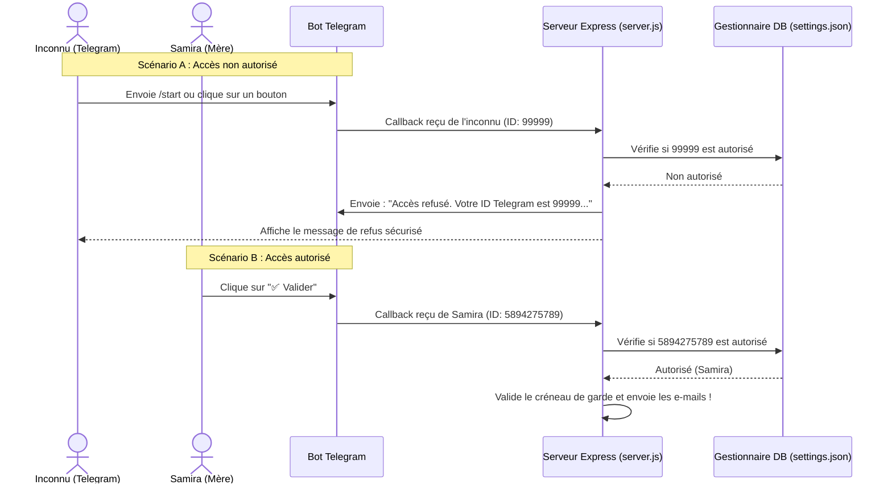

# Plan d'implémentation : Sécurisation du Bot Telegram

Ce plan détaille la sécurisation complète du Bot Telegram afin de restreindre son accès **uniquement à Samira (la mère) et Chérif (le père)**.

---

## 🔒 Architecture de Sécurité du Bot

Actuellement, n'importe quel utilisateur sur Telegram peut trouver le bot, lui envoyer `/start` et s'enregistrer comme destinataire des plannings. Pour remédier à cela, nous allons implémenter un système d'**autorisation par Chat ID dynamique** géré depuis le tableau de bord (IHM).



---

## 🔧 Modifications proposées par composant

### 1. Fichier de base de données ([settings.json](file:///C:/Users/Aliaspieces/.gemini/antigravity/brain/eb535625-0447-4cf9-88f9-d0f6b2354952/settings.json))
Extension du fichier pour stocker les Chat IDs autorisés. 
*Note : Au premier démarrage, nous pré-remplirons automatiquement le Chat ID de Samira à partir de l'ancienne valeur du `.env` (`5894275789`) pour éviter toute déconnexion.*

```json
{
  "pereEmail": "",
  "mereEmail": "",
  "cherifChatId": "",
  "samiraChatId": "5894275789"
}
```

### 2. [db.js](file:///C:/Users/Aliaspieces/.gemini/antigravity/brain/eb535625-0447-4cf9-88f9-d0f6b2354952/db.js)
- Mise à jour de `initSettings()` pour ajouter les clés `cherifChatId` et `samiraChatId` par défaut (avec migration automatique de `process.env.TELEGRAM_SAMIRA_CHAT_ID` pour préserver l'existant).

### 3. [server.js](file:///C:/Users/Aliaspieces/.gemini/antigravity/brain/eb535625-0447-4cf9-88f9-d0f6b2354952/server.js)
- Sécurisation de `handleTelegramMessage(msg)` :
  - Si un utilisateur envoie `/start`, le bot lui répond poliment en lui indiquant son propre **ID Telegram** (ex: `5894275789`) et lui explique comment le coller sur le tableau de bord pour s'autoriser.
  - Pour tous les autres messages : le serveur charge les paramètres via `db.getSettings()` et vérifie si le `chatId` correspond à `samiraChatId` ou `cherifChatId`. Si ce n'est pas le cas, le message est **complètement ignoré**.
- Sécurisation de `handleTelegramCallback(query)` :
  - Vérification stricte de l'autorisation de l'émetteur du clic. Si l'utilisateur n'est pas autorisé dans les paramètres, un message d'alerte Telegram est renvoyé ("⚠️ Accès non autorisé") et l'action est **bloquée**.

### 4. [public/index.html](file:///C:/Users/Aliaspieces/.gemini/antigravity/brain/eb535625-0447-4cf9-88f9-d0f6b2354952/public/index.html)
- Ajout de deux champs de texte dans la carte des e-mails (renommée **Emails & Sécurité Telegram**) :
  - **ID Telegram du Père (Chérif)**
  - **ID Telegram de la Mère (Samira)** (pré-rempli)

### 5. [public/app.js](file:///C:/Users/Aliaspieces/.gemini/antigravity/brain/eb535625-0447-4cf9-88f9-d0f6b2354952/public/app.js)
- Prise en charge du chargement et de la sauvegarde des identifiants Telegram (`cherifChatId` et `samiraChatId`) en même temps que les adresses e-mail.

---

## 🧪 Plan de Vérification

1. **Test de l'inconnu (Intrus)** : 
   - Utiliser un autre compte Telegram (ou simuler un Chat ID différent).
   - Cliquer sur les boutons ou envoyer un message.
   - Vérifier que le Bot répond avec un message d'exclusion sécurisé et que le statut du créneau ne change **pas**.
2. **Test du père / de la mère (Autorisé)** :
   - Renseigner le bon Chat ID dans l'IHM et cliquer sur Sauvegarder.
   - Effectuer l'action depuis ce compte Telegram.
   - Vérifier que l'accès est immédiatement autorisé et que le créneau est validé avec succès.
